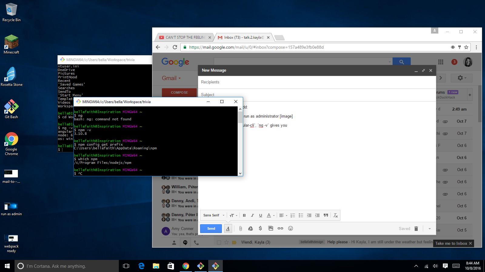

# Using Angular CLI on Windows

To use Angular CLI on Windows, it is recommended to `Run as Administrator` (for `Git Bash` or whatever CLI tool you are using). Othwerwise, your commands will take a bit and you'll be twiddling your thumbs for a bit. This is especially true for the `ng build`, `ng serve` and `ng github-pages:deploy` commands. Here are some helpful tips for running your CLI as _admin_.

*Notes:*

_Below I use `<` & `>` to surround values that you should replace for your username or something. When you replace these values with your own *do not include* the `<` and `>`._

_From this point on, I'm going to assume the CLI tool you're using is *Git Bash*._

## How to Run as Admin

Right click on the _Git Bash_ icon & select the `Run as Administrator` option.

Not too hard, eh?

_Note: Don't get too optimistic. You may run into some issues. If you do, see tips below._

## After installing Angular CLI [remember that `npm install -g angular-cli` command?], I get `ng: command not found`

When attempting to run an `ng` command (say `ng -v` or `ng new ...`), do you see something like this?

`bash: ng: command not found`

_Angular CLI may not have installed correctly. If so, it could be you need a more recent version of `Node` or `npm`._

If Angular CLI did install correctly & you're getting `command not found`, try this:
In _Git Bash_, type: `npm config get prefix`
_This will provide you the path to where your `npm` command ... TODO_
`C:\Users\<yourUsername>\AppData\Roaming\npm`

Copy this into a text file & reformat it to look like this:
`/c/Users/<yourUsername>/AppData/Roaming/npm`

_*Tip*: `ctrl + v` doesn't work to paste into Git Bash. Instead use `shift + insert` or `shift + ins`._

You're going to add this reformatted path, to your `PATH` variable. In Git Bash, type: `PATH=$PATH:<yourReformattedPathHere>` [should look similar to this `PATH=$PATH:/c/Users/bellafaith/AppData/Roaming/npm`]

Try `ng version` in Git Bash again ... did it work?

## Running as Admin? Path to your *trivia* folder may be a bit different

If you're running Git Bash as admin & the account you're actively logged into on your computer is _*not*_ the admin account, the path to access your directory in Git Bash may be slightly different. You may not see your `CodingAndCocktails` directory in your `/` or `~` folder. Try the following in Git Bash:

`cd /c/Users/<yourUsername>/CodingAndCocktails/trivia`
